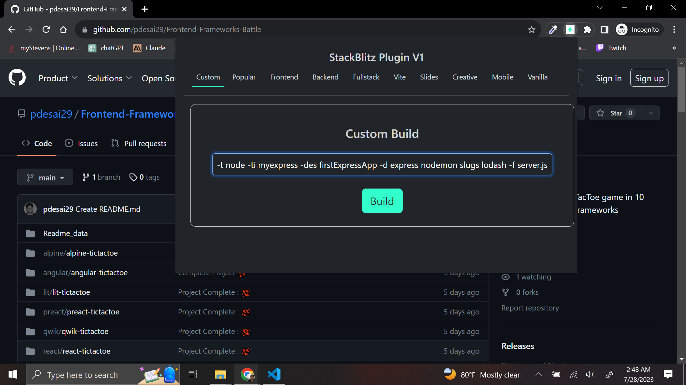
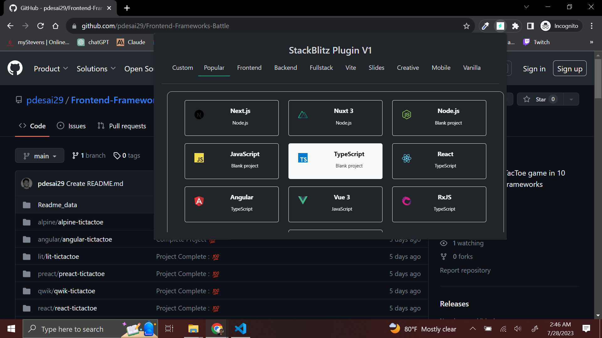
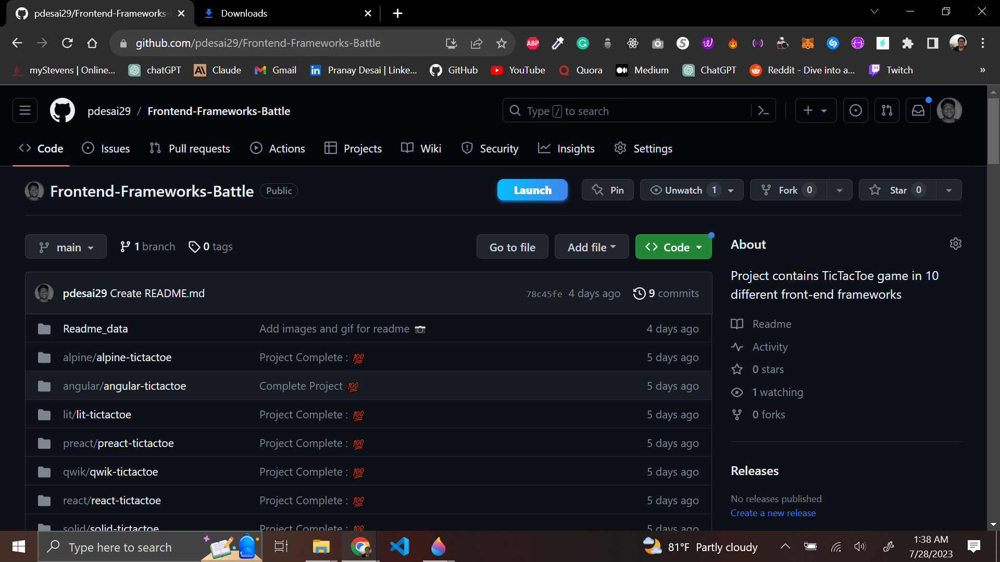

# Blitzify-Chrome-Extension
Blitzify is a powerful Chrome extension that simplifies the development process by providing a seamless and efficient way to create and manage development environments. Whether you're a seasoned developer or just getting started, this extension has got you covered with its user-friendly prompts and support for premade project starters.

## Demo 📺


## Features 🏍️
### Web Container API Integration

<p>Blitzify seamlessly integrates with StackBlitz's Web Container API to create development environments based on user prompts. You can easily set up your project's template, title, description, dependencies, files, and start script without any hassle.
</p>
<hr/>

### Usage Instructions

Use the following command-line arguments to set up your development environment project:

- `-ti` for Title
  Ex Usage: `-ti myExpressApp`

- `-des` for Description of the development environment project
  Ex Usage: `-des my first express app`

- `-d` for dependencies you want to install on your development environment container
  Ex Usage: `-d express nodemon mongoose morgan`

- `-f` for any files you want in your container
  Ex Usage: `-f server.js app.js`

- `-s` for the start script of your project
  Ex Usage: `-s nodemon server.js`

### Example

To create a new project with the following settings:
- Title: myexpress
- Description: firstExpressApp
- Dependencies: express, nodemon, slugs, lodash
- Files: server.js, app.js
- Start Script: nodemon server.js

Run the following command:

```bash
-t node -ti myexpress -des firstExpressApp -d express nodemon slugs lodash -f server.js app.js -s nodemon server.js
```

<hr/>

### Premade Project Starters
<p>Blitzify comes with built-in support for popular premade project starters for both frontend and backend development. Choose from a wide range of options, including Next.js, Nuxt.js, React, Angular, Vue.js, JavaScript, TypeScript, RxJS, Web Container API, and more. Whether you're building a full-stack application or focusing on mobile development, there's a starter environment for you.
</p>
<h4>Available Project Starters:</h4>
<p>Frontend | Backend | Fullstack | Vite | Slides | Creative | Mobile | Vanilla</p>

<hr/>

### GitHub Integration with "Launch" Button:
<p>Blitzify enhances your GitHub experience by adding a convenient "Launch" button to GitHub repository pages. With a single click, you can instantly view, review, and run code from the repository on a running online development environment, without the need to download it to your local machine. This feature streamlines the collaboration process and makes it easier to evaluate projects on the go.</p>

<hr/>

### I personally use it for testing npm packages or libraries, instead of starting IDE and downloading packages on a local machine, I use this extension.
